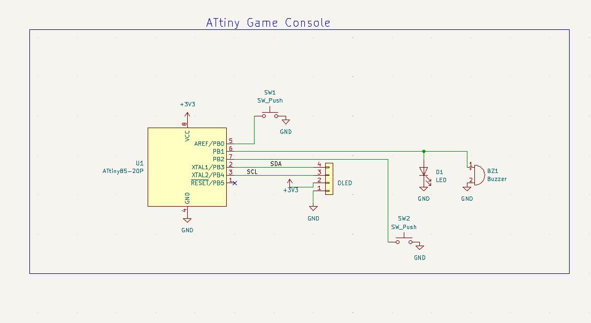
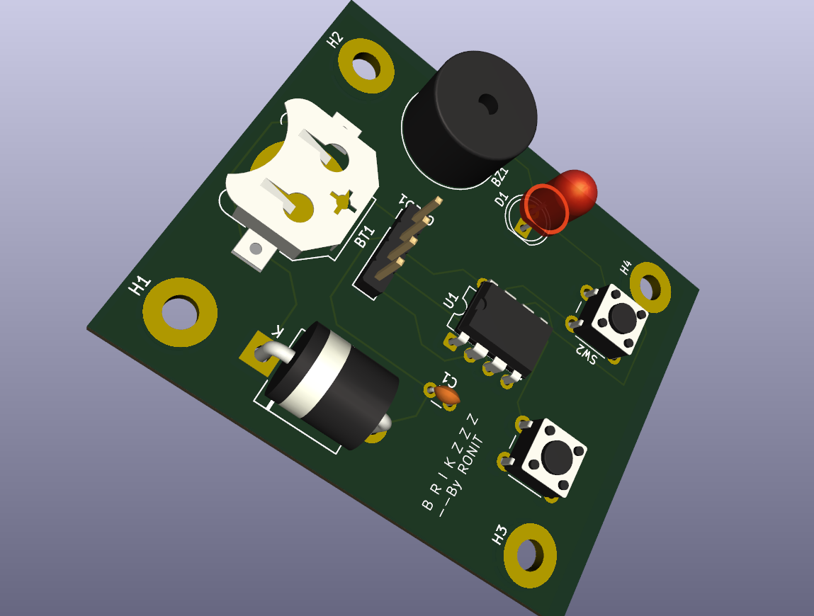

# OLED Breakout Game (ATtiny85)

A minimalistic breakout-style arcade game built on the ATtiny85 microcontroller with an SSD1306 OLED display.

## 🎮 Features
- Ball + Paddle Physics
- Brick Collision Detection
- Button-based Paddle Control
- Sound via Buzzer
- Entirely runs on ATtiny85 (8KB Flash)

## 🛠️ Hardware Used
- ATtiny85 (internal 8MHz)
- SSD1306 OLED 128x64 (I2C)
- Push Buttons
- Active Buzzer
- 3.3V Power Supply (Battery or Regulated)

## 📷 Demo

## Hardware Preview

## 🔌 Wiring
| ATtiny85 Pin | Connected To    |
|--------------|-----------------|
| PB0 (pin 5)  | Button Left     |
| PB1 (pin 6)  | Button Right    |
| PB2 (pin 7)  | OLED SDA        |
| PB4 (pin 3)  | OLED SCL        |
| PB3 (pin 2)  | Buzzer (via 100Ω)|

## Hardware Design
The project now includes a custom-designed PCB made using KiCad. The board integrates the ATtiny85, buzzer, tactile switches, and headers for OLED connection. Schematic, layout, and production-ready files are included in the [`hardware/`](hardware/) folder.

## 📂 Folder Structure
- `attiny_breakout_game.ino` – Main source code
- `font6x8.h` – Font data used for display
- `images/` – Screenshots and wiring diagram
- `hardware/` - Hardware files related to PCB
## 📝 License
MIT License — see LICENSE file.

## 🙋‍♂️ Author
Ronit — [LinkedIn](https://www.linkedin.com/in/ronit-rajendra-patil/) | [GitHub](https://github.com/R-onit/BRICKZZZ/tree/main) |[Youtube](https://youtu.be/keeT_vdv5o0)
